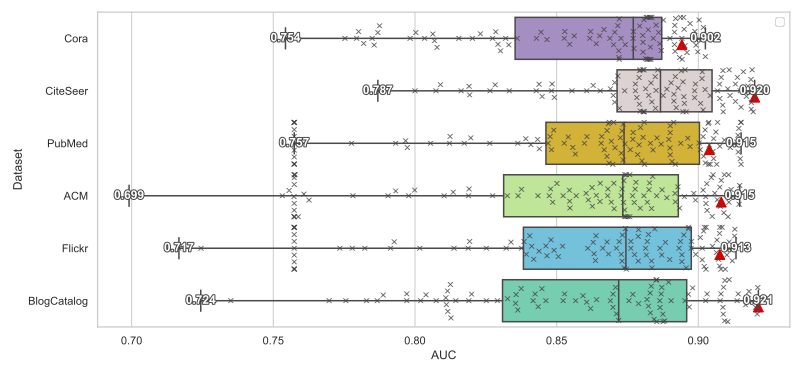
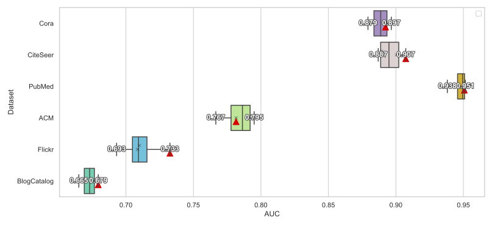
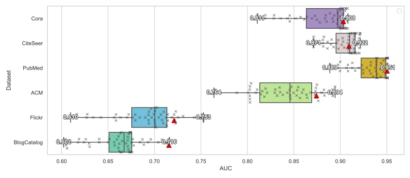

# AutoGAD: Automated Self-Supervised Learning for Truly Unsupervised Graph Anomaly Detection

[](https://link.springer.com/article/10.1007/s10618-025-01115-5)
[](https://aaai.org/)
[](https://doi.org/10.1007/s10618-025-01115-5)
[](https://creativecommons.org/licenses/by-sa/4.0/)
[](https://www.python.org/)
[](https://visitorbadge.io/status?path=ZhongLIFR%2FAutoGAD2024)

This is the official repository for the paper:

> **Towards Automated Self-Supervised Learning for Truly Unsupervised Graph Anomaly Detection**  
> Published in **Data Mining and Knowledge Discovery (DAMI)**, 2025.  
> Also accepted for presentation at the **AAAI 2026 Journal Track**.  
> [Springer](https://link.springer.com/article/10.1007/s10618-025-01115-5) | [DOI](https://doi.org/10.1007/s10618-025-01115-5)

AutoGAD is a lightweight, plug-and-play framework for automating self-supervised learning (SSL) in **truly unsupervised graph anomaly detection (GAD)**. The central motivation is simple but important: many SSL-based GAD methods tune augmentation choices, hyperparameters, or loss weights using ground-truth labels, which causes **label information leakage** and can substantially overestimate unsupervised performance.

AutoGAD avoids this by using an internal evaluation strategy to select SSL configurations without relying on anomaly labels.

---

## Highlights

- **Truly unsupervised model selection**: AutoGAD selects SSL strategies, hyperparameters, and combination weights without using ground-truth anomaly labels.
- **Label-leakage awareness**: The paper highlights a common but often overlooked issue in unsupervised GAD evaluation: tuning with labels silently turns the setting into a supervised one.
- **Plug-and-play design**: AutoGAD can be applied to existing SSL-based GAD algorithms without redesigning their architectures.
- **Theoretical support**: The internal evaluation strategy is accompanied by theoretical analysis explaining why it can guide configuration selection.
- **Broad empirical validation**: The published paper evaluates 10 state-of-the-art SSL-based GAD algorithms across 10 benchmark datasets.

---

## Method Overview

SSL-based GAD methods often require several choices:

1. Which SSL strategy or augmentation function should be used?
2. Which hyperparameters should be used for that strategy?
3. How should multiple SSL losses or strategies be weighted?

In a truly unsupervised setting, validation labels are not available. AutoGAD therefore replaces label-guided tuning with an internal evaluation criterion that estimates the quality of a configuration using only the graph data and model outputs. This allows SSL-based GAD pipelines to adapt to different datasets while avoiding label leakage.

At a high level, AutoGAD follows this workflow:

1. Generate candidate SSL configurations for a base GAD algorithm.
2. Train or evaluate the base algorithm under these configurations.
3. Score configurations using the internal evaluation strategy.
4. Select the best configuration without accessing ground-truth anomaly labels.
5. Report anomaly scores from the selected SSL-GAD model.

---

## Performance Examples

### SL-GAD



### CoLA



### ANEMONE



---

## Repository Structure

```text
AutoGAD2024/
├── ANEMONE/                 # ANEMONE implementation and experiments
├── CoLA/                    # CoLA implementation and experiments
├── GRADATE/                 # GRADATE implementation and experiments
├── SL-GAD/                  # SL-GAD implementation and experiments
├── Sub-CR/                  # Sub-CR implementation and experiments
├── Others/                  # PyGOD-based algorithms
├── Performances/            # Example performance figures
├── experiments_1.sh         # Runs ANEMONE, CoLA, GRADATE, SL-GAD, Sub-CR
└── experiments_2.sh         # Runs PyGOD-based algorithms
```

Each algorithm directory stores its own outputs under an `Output` sub-directory.

---

## Running the Algorithms

### ANEMONE, CoLA, GRADATE, SL-GAD, and Sub-CR

Recommended environment:

```text
Python 3.7.8
torch==1.10.2
dgl==0.4.1
numpy==1.19.2
```

Run:

```bash
chmod u+x ./experiments_1.sh
./experiments_1.sh
```

---

### PyGOD-Based Algorithms

Recommended environment:

```text
Python >= 3.8.1
torch >= 2.0.0
torch_geometric >= 2.3.0
pygod == 1.0.0
```

Before running the PyGOD-based algorithms, replace the `base.py` file in the PyGOD package with the provided version in this repository.

Run:

```bash
chmod u+x ./experiments_2.sh
./experiments_2.sh
```

---

## Citation

If you find this repository useful, please cite our paper:

```bibtex
@article{li2025towards,
  title={Towards automated self-supervised learning for truly unsupervised graph anomaly detection},
  author={Zhong Li and Yuhang Wang and Matthijs van Leeuwen},
  journal={Data Mining and Knowledge Discovery},
  volume={39},
  year={2025},
  doi={10.1007/s10618-025-01115-5},
  url={https://doi.org/10.1007/s10618-025-01115-5}
}
```

---

## License

This repository is released under the **CC BY-SA 4.0** license.

---

## Contact

For questions, bug reports, or suggestions, please open an issue in this repository.
