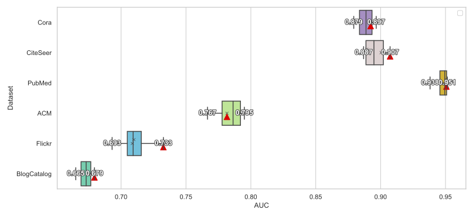
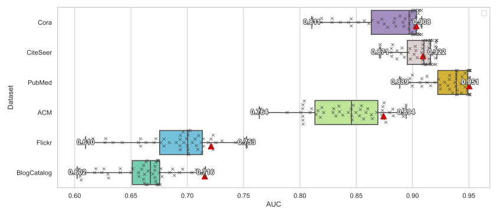

# Towards Automated Self-Supervised Learning for Truly Unsupervised Graph Anomaly Detection

Paper submitted to DAMI (Data Mining and Knowledge Discovery journal) for publication (May 2024)

## Contribution

Overall, our main contributions are as follows:

- We raise awareness to the *label information leakage* issue, which is critical but often overlooked in the unsupervised GAD (Graph Anomaly Detection) field;
- Although there exists a plethora of graph SSL (Semi-Supervised Learning) methods and GAD approaches, we are the first to investigate automated SSL for unsupervised GAD;
- We propose a lightweight, plug-and-play approach, to automate SSL for truly unsupervised GAD and provide theoretical analysis;
- Extensive experiments are conducted using 10 state-of-the-art SSL-based GAD algorithms on 6 benchmark datasets, demonstrating the effectiveness of our approach.

## Performance

### Alg: SL-GAD


### Alg: CoLA


### Alg: ANEMONE


## Code Structure

This repository is organized into several directories, each dedicated to a specific algorithm. Below is a description of these directories and their contents:

- **ANEMONE, CoLA, GRADATE, SL-GAD, Sub-CR**: Each of these directories contains the implementation of a distinct algorithm. To run an algorithm, navigate to its directory and execute the `run.py` file. 
- **Others**: This directory includes implementations of five algorithms based on the Pygod package.

- **Results**: All results will be stored in the `Output` sub-directory within each algorithm's folder.

## Running the Algorithms

#### For ANEMONE, CoLA, GRADATE, SL-GAD, Sub-CR

To run these algorithms, ensure your environment is set up with the following:

- Python 3.7.8
- torch==1.10.2
- dgl==0.4.1
- numpy==1.19.2

Run the experiments with the command:

```bash
./experiments_1.sh
```

### For Pygod-based Algorithms

To run the Pygod-based algorithms, your environment should meet the following specifications:

- Python >= 3.8.1
- torch >= 2.0.0
- torch_geometric >= 2.3.0
- pygod == 1.0.0

**Important Step:** Before running the Pygod-based algorithms, it's necessary to replace the `base.py` file in the Pygod package with the one provided in this directory.

To run these algorithms and generate the experimental results, execute the following command:

```bash
./experiments_2.sh
```
